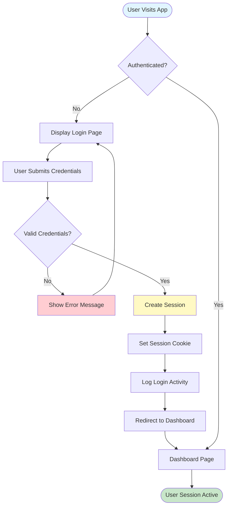
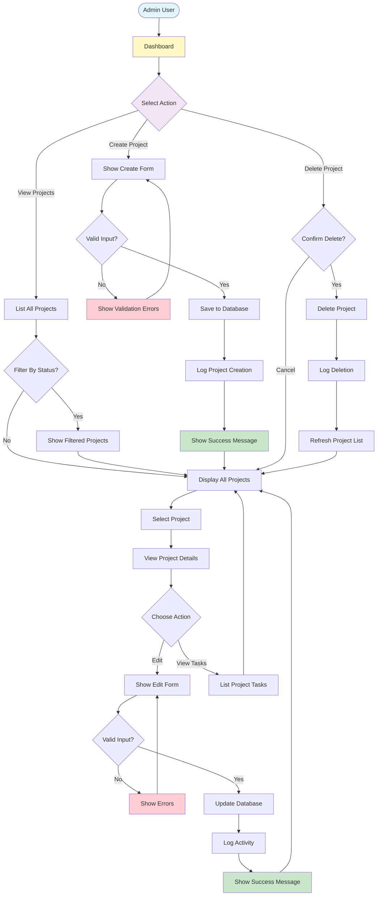
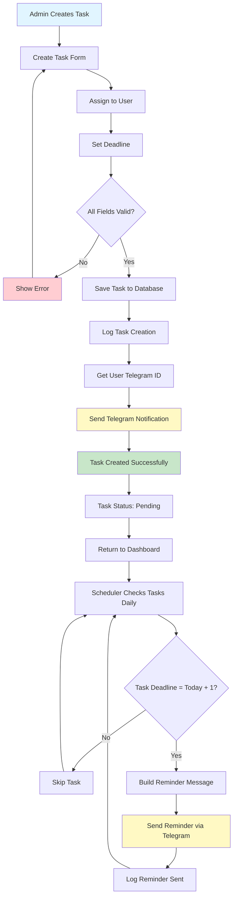
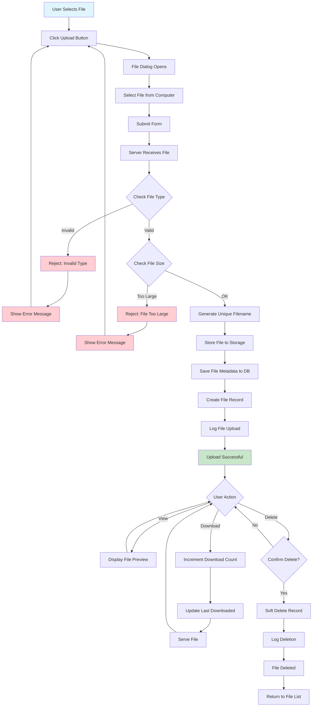
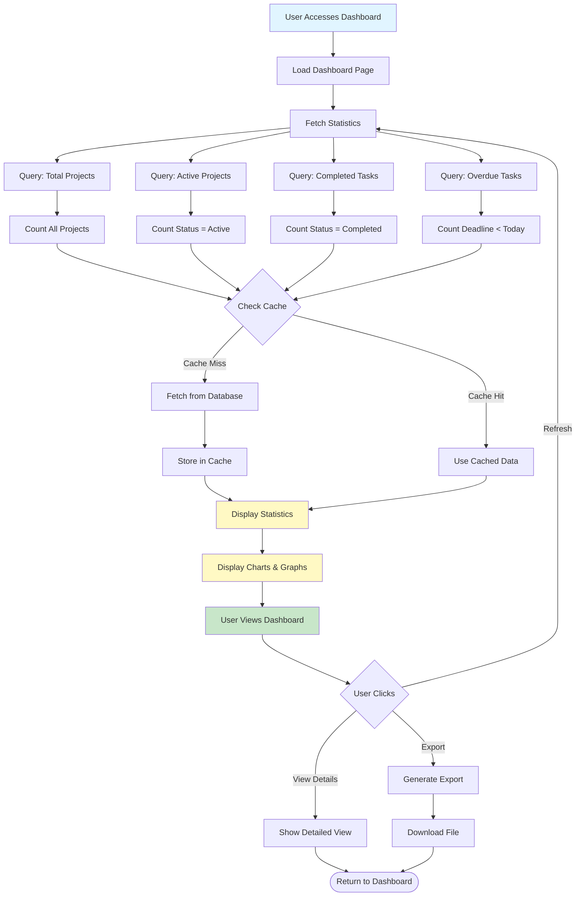
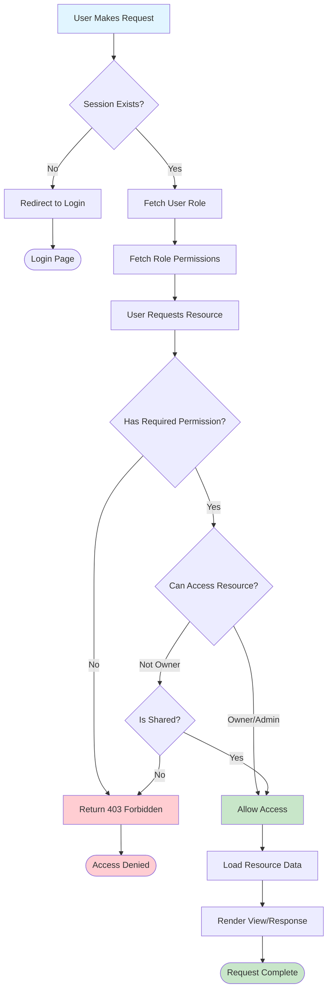
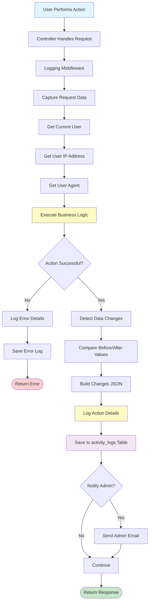
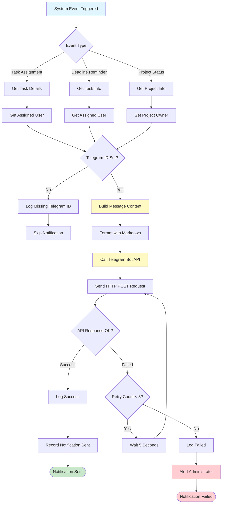
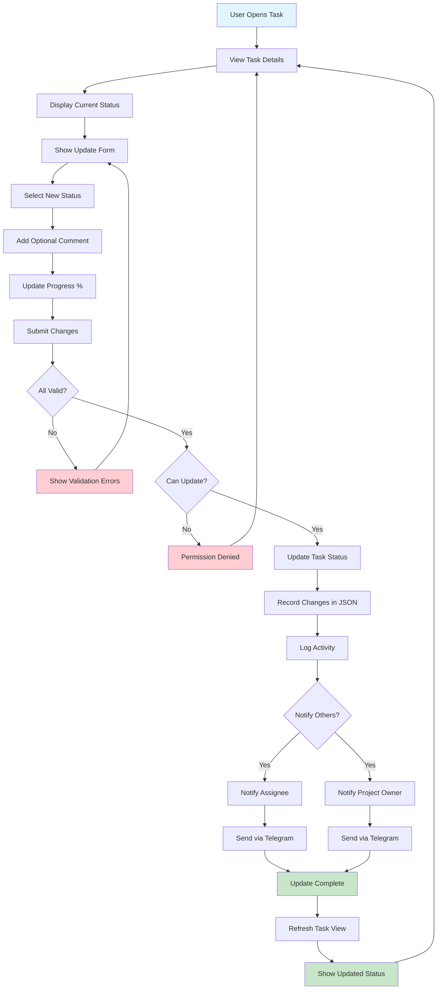
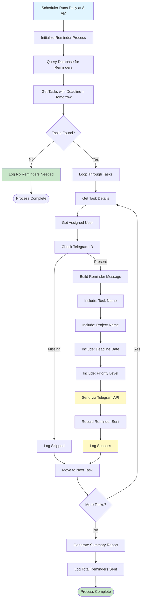

# System Flow Diagrams - Project Management Dashboard

Visual representations of system processes and user interactions.

---

## 1. User Authentication Flow



---

## 2. Project Management Flow



---

## 3. Task Assignment and Notification Flow



---

## 4. File Upload and Management Flow



---

## 5. Dashboard Analytics Flow



---

## 6. Role-Based Access Control Flow



---

## 7. Activity Logging Flow



---

## 8. Telegram Bot Notification System



---

## 9. Task Status Update Flow



---

## 10. Scheduled Task Reminder Process



---

## Legend

```
┌─────────────────────┐
│   Start/End Point   │ = Start or end of a process
└─────────────────────┘

    ┌─────────┐
    │ Process │ = Action or operation
    └─────────┘

    ╱─────────╲
   │ Decision │ = Conditional branch
    ╲─────────╱

    ─────────→ = Flow direction
```

Color Legend:
- **Blue**: User action or input
- **Yellow**: Processing or API call
- **Green**: Success completion
- **Red**: Error or denial
- **Purple**: Data storage

---

**[← Back to Database Design](../DATABASE.md)**
