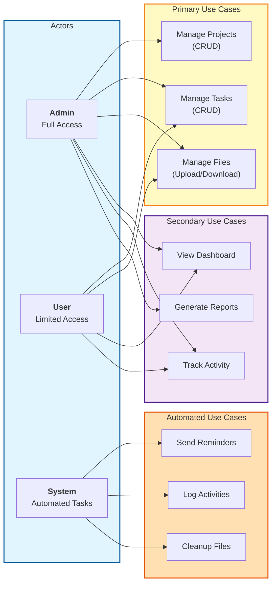
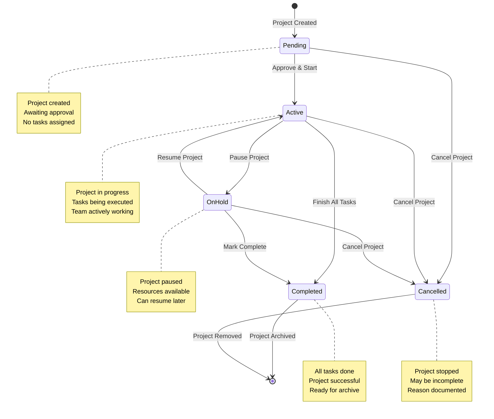
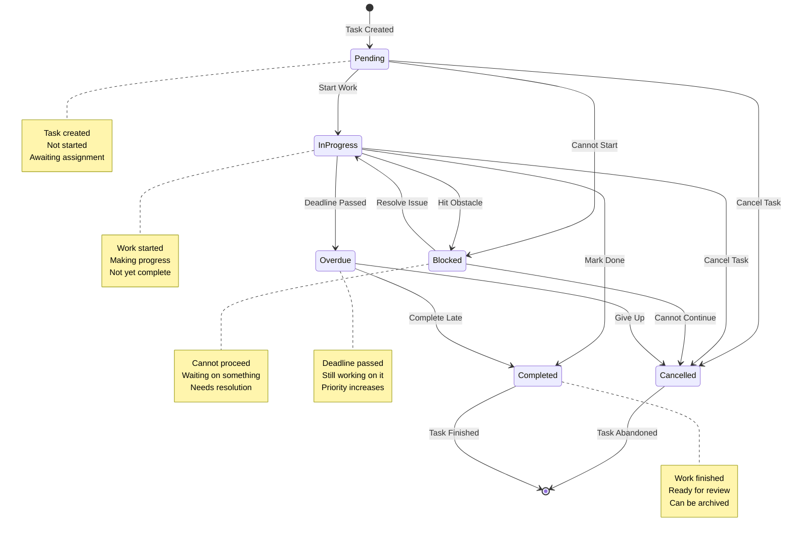
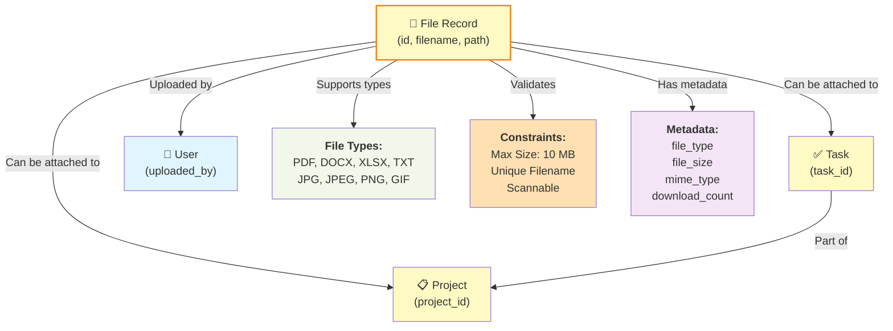
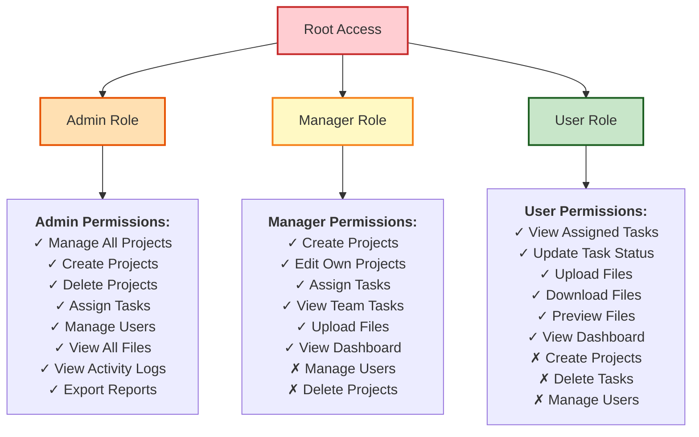
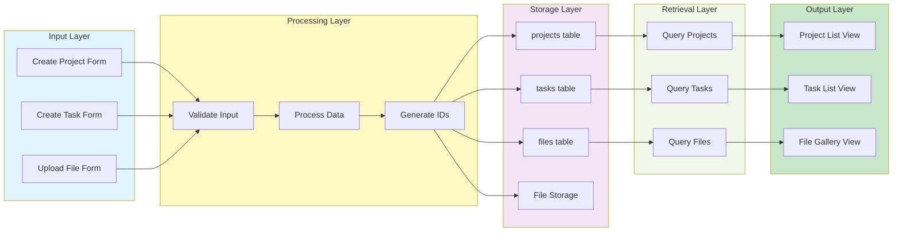
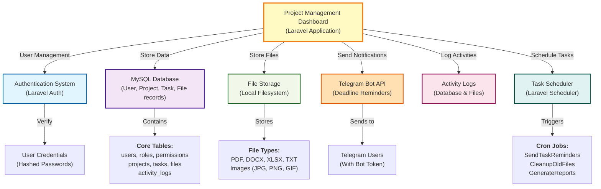

# Use Case and Entity Relationship Diagrams

Comprehensive visual representations of system functionality and data structure.

---

## 1. Use Case Diagram - Complete System

```mermaid
graph TB
    Admin["👤 Admin User"]
    RegularUser["👤 Regular User"]
    
    subgraph AuthSystem["🔐 Authentication System"]
        Login["Login"]
        Logout["Logout"]
        Register["Register Account"]
        ResetPassword["Reset Password"]
    end
    
    subgraph ProjectMgmt["📋 Project Management"]
        ViewProjects["View All Projects"]
        CreateProject["Create Project"]
        EditProject["Edit Project"]
        DeleteProject["Delete Project"]
        AssignProject["Assign to User"]
        FilterProjects["Filter Projects"]
    end
    
    subgraph TaskMgmt["✅ Task Management"]
        ViewTasks["View Tasks"]
        CreateTask["Create Task"]
        UpdateTask["Update Task Status"]
        AssignTask["Assign Task"]
        SetPriority["Set Priority"]
        DeleteTask["Delete Task"]
        ViewTaskDetail["View Task Details"]
    end
    
    subgraph FileMgmt["📁 File Management"]
        UploadFile["Upload File"]
        PreviewFile["Preview File"]
        DownloadFile["Download File"]
        DeleteFile["Delete File"]
        ListFiles["List All Files"]
    end
    
    subgraph Dashboard["📊 Dashboard & Analytics"]
        ViewStats["View Statistics"]
        ViewCharts["View Charts"]
        ExportData["Export Data"]
        ViewActivityLog["View Activity Log"]
    end
    
    subgraph Notifications["🔔 Notifications"]
        SendReminder["Send Deadline Reminder"]
        NotifyAssignment["Notify Task Assignment"]
        NotifyStatusChange["Notify Status Change"]
    end
    
    subgraph UserMgmt["👥 User Management"]
        ManageUsers["Manage Users"]
        AssignRoles["Assign Roles"]
        SetPermissions["Set Permissions"]
    end
    
    Admin --> AuthSystem
    Admin --> ProjectMgmt
    Admin --> TaskMgmt
    Admin --> FileMgmt
    Admin --> Dashboard
    Admin --> Notifications
    Admin --> UserMgmt
    
    RegularUser --> AuthSystem
    RegularUser --> ViewProjects
    RegularUser --> ViewTasks
    RegularUser --> UpdateTask
    RegularUser --> ViewTaskDetail
    RegularUser --> UploadFile
    RegularUser --> PreviewFile
    RegularUser --> DownloadFile
    RegularUser --> ViewStats
    RegularUser --> ViewActivityLog
    
    CreateProject -.-> AssignProject
    CreateTask -.-> AssignTask
    AssignTask -.-> SendReminder
    UpdateTask -.-> NotifyStatusChange
    
    style AuthSystem fill:#e1f5ff
    style ProjectMgmt fill:#f3e5f5
    style TaskMgmt fill:#fff9c4
    style FileMgmt fill:#f1f8e9
    style Dashboard fill:#fce4ec
    style Notifications fill:#ffe0b2
    style UserMgmt fill:#e0f2f1
```



---

## 2. Actor and Use Case Relationships



---

## 3. Entity Relationship Diagram (Detailed)

```mermaid
erDiagram
    USERS ||--|| ROLES : "has"
    USERS ||--o{ PROJECTS : "creates_as_owner"
    USERS ||--o{ PROJECTS : "assigned_to"
    USERS ||--o{ TASKS : "assigned_to"
    USERS ||--o{ FILES : "uploads"
    USERS ||--o{ ACTIVITY_LOGS : "performs"
    
    ROLES ||--o{ PERMISSIONS : "has"
    
    PROJECTS ||--o{ TASKS : "contains"
    PROJECTS ||--o{ FILES : "has"
    PROJECTS ||--o{ ACTIVITY_LOGS : "generates"
    
    TASKS ||--o{ FILES : "may_have"
    TASKS ||--o{ ACTIVITY_LOGS : "generates"
    
    FILES ||--o{ ACTIVITY_LOGS : "generates"
    
    USERS {
        bigint id PK
        string name
        string email UK
        string password
        bigint role_id FK
        string telegram_chat_id
        enum status
        timestamp last_login_at
        timestamp created_at
        timestamp updated_at
    }
    
    ROLES {
        bigint id PK
        string name UK
        text description
        timestamp created_at
        timestamp updated_at
    }
    
    PERMISSIONS {
        bigint id PK
        string name UK
        text description
        string resource
        string action
        timestamp created_at
        timestamp updated_at
    }
    
    PROJECTS {
        bigint id PK
        string name
        string client_name
        text description
        date deadline
        enum status
        bigint assigned_to FK
        bigint created_by FK
        timestamp created_at
        timestamp updated_at
        timestamp deleted_at ST
    }
    
    TASKS {
        bigint id PK
        bigint project_id FK
        string name
        text description
        enum priority
        date deadline
        enum status
        bigint assigned_to FK
        int progress_percentage
        timestamp created_at
        timestamp updated_at
        timestamp deleted_at ST
    }
    
    FILES {
        bigint id PK
        bigint task_id FK
        bigint project_id FK
        bigint uploaded_by FK
        string filename
        string original_filename
        string file_type
        bigint file_size
        string file_path
        string mime_type
        int download_count
        timestamp last_downloaded_at
        timestamp created_at
        timestamp deleted_at ST
    }
    
    ACTIVITY_LOGS {
        bigint id PK
        bigint user_id FK
        string action
        string model_type
        bigint model_id
        text description
        json changes
        string ip_address
        text user_agent
        timestamp created_at
    }
```

---

## 4. Relationship Cardinality Details

### One-to-Many Relationships

```
USER (1) ──────→ (Many) PROJECTS
└─ One user can create multiple projects
└─ One user can be assigned multiple projects

USER (1) ──────→ (Many) TASKS
└─ One user can be assigned multiple tasks

PROJECT (1) ────→ (Many) TASKS
└─ One project can have many tasks

PROJECT (1) ────→ (Many) FILES
└─ One project can have multiple files

TASK (1) ──────→ (Many) FILES
└─ One task can have multiple attachments

ROLE (1) ──────→ (Many) PERMISSIONS
└─ One role can have many permissions
```

### Many-to-Many Relationships

```
USERS (Many) ←──→ (Many) ROLES
└─ Future: Single user could have multiple roles
└─ Currently: Single role per user (via role_id)

ROLES (Many) ←──→ (Many) PERMISSIONS
└─ Implemented via pivot table: role_permissions
└─ One role can have multiple permissions
└─ One permission can be assigned to multiple roles
```

---

## 5. Project Lifecycle Diagram



---

## 6. Task Lifecycle Diagram



---

## 7. File Attachment Relationships



---

## 8. Permission Hierarchy



---

## 9. Data Flow Between Entities



---

## 10. System Integration Points



---

## Diagram Symbols Reference

```
┌──────────────────────────────────────┐
│         Entity/Table                 │  = Database table or entity
├──────────────────────────────────────┤
│ PK  = Primary Key                    │
│ FK  = Foreign Key                    │
│ UK  = Unique Key                     │
│ ST  = Soft Delete (timestamp)        │
└──────────────────────────────────────┘

    ──────────→
       1:N     = One-to-Many relationship

    ←─────────→
       N:N     = Many-to-Many relationship

    ──────────
       1:1     = One-to-One relationship

    ─ · ─ · ─→
    (include)  = Includes or extends
```

---

## Quick Reference Tables

### Status Enumerations

| Entity | Status Values | Meaning |
|--------|---------------|---------|
| Project | active, on_hold, completed, cancelled | Project lifecycle states |
| Task | pending, in_progress, completed, overdue, blocked | Task progress states |
| User | active, inactive, suspended | User account states |
| File | (none) | Files are soft deleted only |

### Priority Levels

| Priority | Level | Response Time |
|----------|-------|----------------|
| Low | 3 | Can wait weeks |
| Medium | 2 | Should be done soon |
| High | 1 | Urgent |
| Critical | 0 | Immediate attention |

### File Type Categories

| Category | Types | Max Size |
|----------|-------|----------|
| Documents | PDF, DOCX, XLSX, TXT | 10 MB |
| Images | JPG, JPEG, PNG, GIF | 10 MB |
| Archives | ZIP, RAR | 10 MB |
| Total File Size | All types | 10 MB per file |

---

**[← Back to System Flow](./SYSTEM-FLOW.md)**
